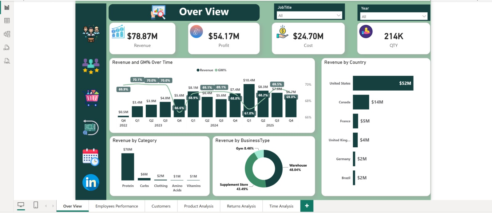
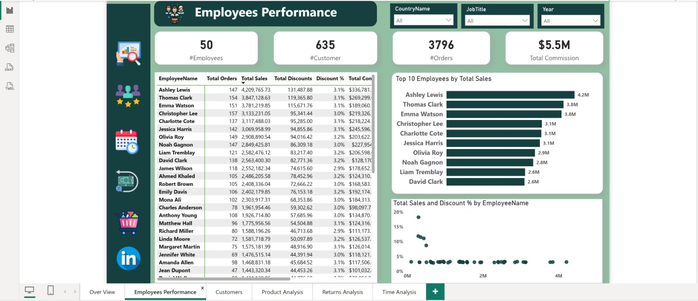
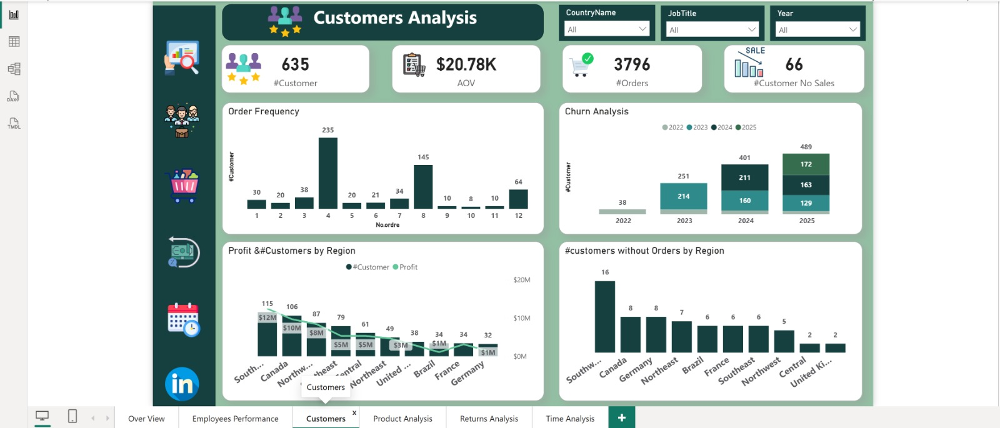
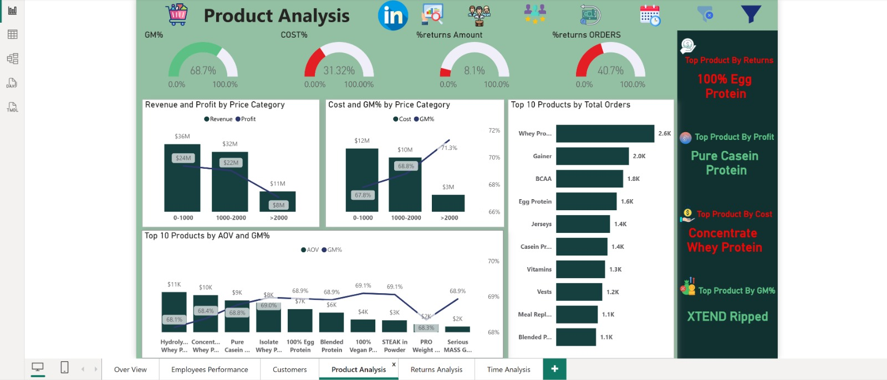
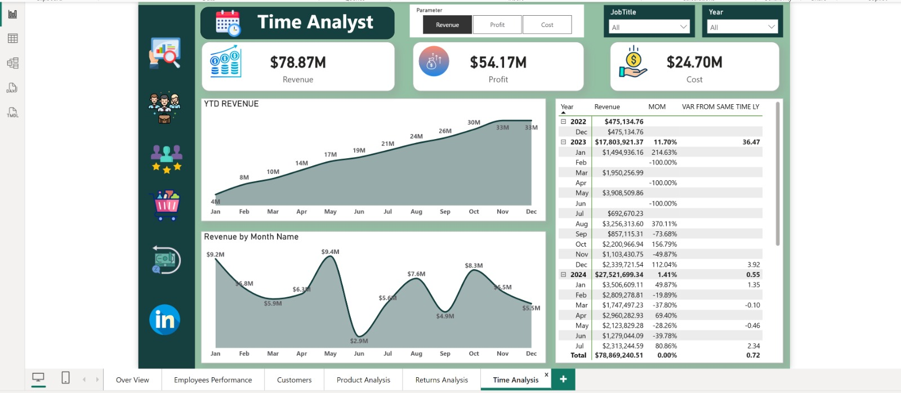
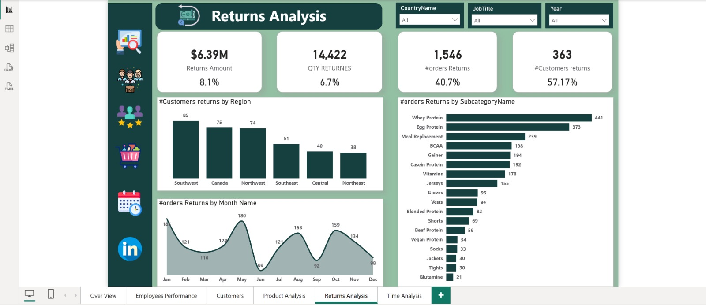
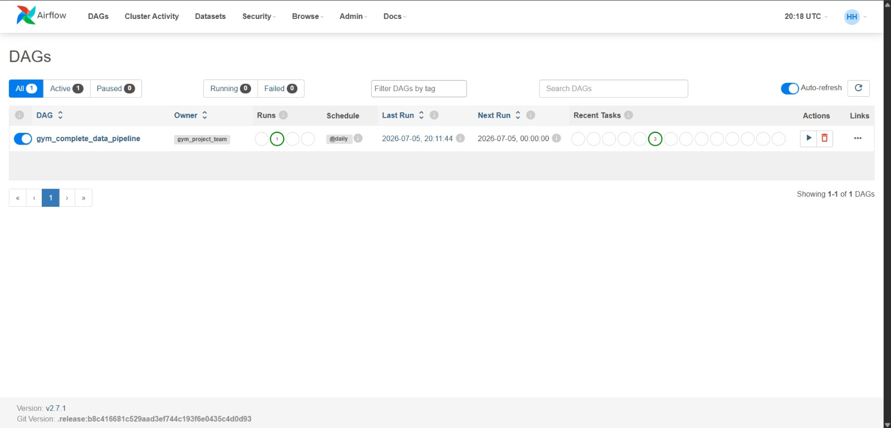
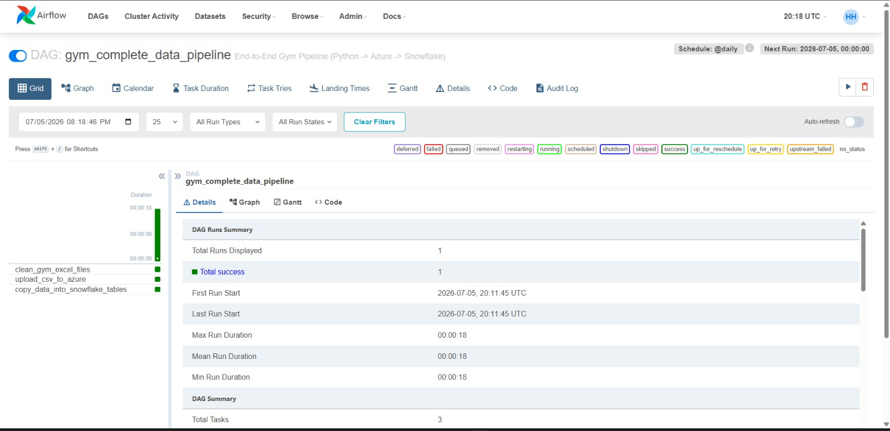
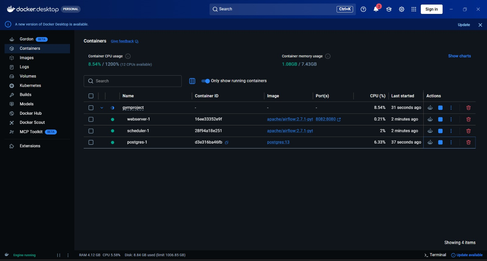
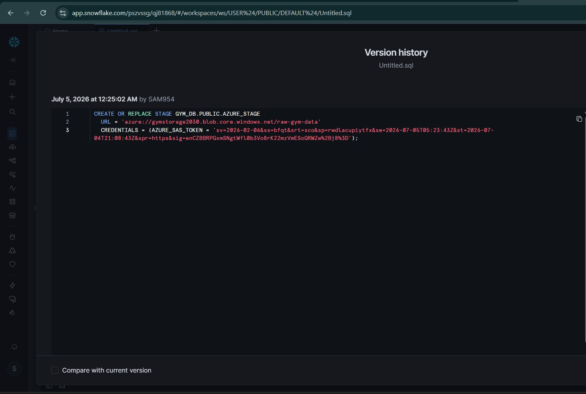

<div align="center">

# 🏋️‍♂️ End-to-End Cloud Data Pipeline
### Gym Management Analytics System

**A cloud-native, in-memory ETL pipeline built on a Medallion architecture — streaming raw gym data through Azure Blob Storage and Snowflake into an executive BI dashboard.**


</div>

---

## 📌 Project Overview

A robust, cloud-native **End-to-End Data Engineering Pipeline** engineered to ingest, transform, and orchestrate relational data for a Gym Management System. Developed as part of the **Digital Egypt Pioneers Initiative (DEPI)**, this architecture transitions traditional local ETL operations into a high-performance **cloud-to-cloud, in-memory ETL pipeline**.

The system leverages **Azure Blob Storage** as a Medallion-structured staging data lake and **Snowflake** as the enterprise data warehouse — fully automated and orchestrated via **Apache Airflow** on **Docker**, culminating in an executive **Power BI dashboard**.

---

## 🚀 Project Highlights

- ⚡ **In-Memory Cloud ETL** — eliminates local disk I/O bottlenecks by streaming raw blobs directly into memory (`io.BytesIO`), cleansing with Pandas, and writing clean CSV output straight back to Azure
- 🥉🥈🥇 **Medallion Data Lake Design** — data separated into `raw-data/` (immutable source lineage) and `cleaned-data/` (analytics staging), feeding a Snowflake Gold-layer star schema
- 🔐 **Zero-Trust Security** — credentials decoupled via environment variables (`.env`), with Snowflake staging secured through least-privilege, time-boxed **SAS tokens**
- 🐳 **Containerized Orchestration** — Apache Airflow deployed with a PostgreSQL metadata backend via `docker-compose`, for scheduled, resilient, automated pipeline runs
- 📊 **Executive BI Reporting** — Snowflake Gold-layer data feeds a multi-page Power BI dashboard for business-ready insights

---

## 🏛️ Architecture & Data Flow

```text
[ Raw Excel/CSV Sources ]
         │
         ▼
[ Azure Blob Storage ]        ── Bronze Layer  (raw-data/)
         │
         ▼  (in-memory stream processing via io.BytesIO)
[ Python ETL Engine ]         ── Cleaned & transformed with Pandas
         │
         ▼
[ Azure Blob Storage ]        ── Silver Layer  (cleaned-data/)
         │
         ▼  (orchestrated by Airflow, secured via SAS token auth)
[ Snowflake Data Warehouse ]  ── Gold Layer  (Star Schema)
         │
         ▼
[ Power BI Dashboard ]        ── Executive KPIs & Reporting
```

---

## 🧰 Technology Stack

<div align="center">

| Layer | Technology |
|---|---|
| **Language** | Python, SQL |
| **Data Processing** | Pandas (in-memory, stream-based) |
| **Cloud Storage** | Azure Blob Storage (Medallion: raw-data / cleaned-data) |
| **Cloud Data Warehouse** | Snowflake (Star Schema) |
| **Security** | SAS Tokens, Environment Variables (`.env`) |
| **Orchestration** | Apache Airflow |
| **Containerization** | Docker / Docker Compose |
| **Metadata Store** | PostgreSQL |
| **Business Intelligence** | Power BI |
| **Version Control** | Git, GitHub |

</div>

---

## 📊 BI Dashboard Preview

<details open>
<summary><strong>Click to view the executive dashboard gallery</strong></summary>

Built on top of the Snowflake Gold Layer, the dashboard is organized into six focused report pages:

**Overview**
<br>Executive summary of revenue, profit, cost, and GM% across the business.
<div align="center"></div>

**Employees Performance**
<br>Sales performance and productivity breakdown by employee.
<div align="center"></div>

**Customers Analysis**
<br>Customer segmentation and purchasing behavior insights.
<div align="center"></div>

**Product Analysis**
<br>Top-performing products and subcategory-level trends.
<div align="center"></div>

**Time Analysis**
<br>Sales trends and seasonality across time periods.
<div align="center"></div>

**Returns Analysis**
<br>Return rates and their impact on revenue and profitability.
<div align="center"></div>

</details>

---

## 🖼️ Pipeline Screenshots

<details>
<summary><strong>🏛️ Architecture &nbsp;•&nbsp; ⚙️ Airflow &nbsp;•&nbsp; 🐳 Docker &nbsp;•&nbsp; ❄️ Snowflake</strong></summary>

| Architecture Diagram | Airflow DAG List |
|---|---|
|  |  |

| Pipeline Run Success | Docker Containers |
|---|---|
|  |  |

<div align="center">

</div>

</details>

---

## 📂 Project Structure

```text
Depi-Project/
│
├── dags/                  # Airflow DAGs for workflow orchestration
├── src/                   # Core Python ETL and Azure Blob connection scripts
├── dashboards/            # Power BI report files
├── data_samples/          # Lightweight data samples (for schema preview)
├── docs/                  # Architecture diagrams and dashboard screenshots
├── docker-compose.yaml    # Containerized Airflow environment definition
├── requirements.txt       # Project dependencies
└── .env.example           # Environment variables template
```

---

## ⚙️ How to Run Locally

**1. Clone the repository**
```bash
git clone https://github.com/mohamedalaah5ss-oss/Depi-Project.git
cd Depi-Project
```

**2. Configure environment variables**

Copy the example environment file and populate your Azure and Snowflake credentials:
```bash
cp .env.example .env
```

**3. Start the orchestration environment (Docker)**
```bash
docker-compose up -d
```
Access the Airflow UI at `http://localhost:8082` (default credentials: `admin` / `admin`).

**4. Run the standalone cloud ETL (optional, outside Airflow)**
```bash
python src/cloud_etl_pipeline.py
```

---

## 🔮 Future Scope

- 🔄 **Incremental Data Loading** — load only new or changed records instead of full refreshes
- ✅ **Data Quality Validation** — automated checks between pipeline stages
- 🧩 **Pipeline Parameterization** — configurable DAG runs for multiple environments
- 🔐 **Azure Key Vault Integration** — production-grade, centralized secret management
- ⚡ **Performance Optimization** — tuning Snowflake warehouse sizing and query performance

---

## 👤 Author

**Mohamed Alaa**
Data Engineering Graduate Project — Digital Egypt Pioneers Initiative (DEPI)

[](https://github.com/mohamedalaah5ss-oss)
[](https://linkedin.com/in/<your-linkedin-profile>)

---

## 📄 License

This project is licensed under the [MIT License](LICENSE).

---

## 🙏 Acknowledgments

- **Digital Egypt Pioneers Initiative (DEPI)** — for program guidance and mentorship
- **Apache Airflow**, **Snowflake**, and **Microsoft Azure** documentation communities
